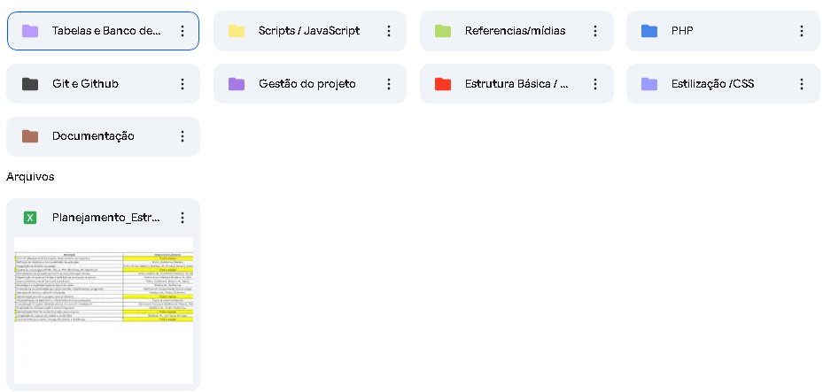

# Projeto de Extensão Universitária FASM 2025
O projeto de extensão universitária (EXTUNI) tem como objetivo unir alunos com diferentes níveis de conhecimento de desenvolvimento para a criação de um projeto real onde foi proposto o desenvolvimento de uma página web para o dominio " https://descubra.muriae.mg.gov.br/" com intuito de integração do conteúdo desenvolvido para uma implementação real do projeto que nos foi proposta em nossa disciplina.

Link para o drive do projeto: (https://drive.google.com/drive/u/6/home)

Email : extensaouniversitaria.2025@gmail.com



---
## Execução (dev)

1. PHP embutido (exemplo):
   ```bash
   php -S localhost:8000 -t .
   ```
   Acesse `http://localhost:8000/HTML/login.html` ou `http://localhost:8000/HTML/Cadastro_de_currículo.html`.

2. Requisitos:
   - PHP 8+
   - MySQL 5.7+/8+

## Banco de Dados

- Configuração em `lib/config.php` (host, porta, base, usuário, senha).
- Rode a migração e seeds:
  - `http://localhost:8000/PHP/migrate.php`
  - Saída deve exibir usuários de teste:
    - PF: CPF `111.444.777-35` | Senha `Teste@123`
    - PJ: CNPJ `11.222.333/0001-81` | Senha `Teste@123`
- Teste conexão: `http://localhost:8000/PHP/db_check.php`

## Fluxos integrados

- Login PF/PJ (`PHP/login.php`):
  - PF: CPF + senha (tabela `usuarios_pf`)
  - PJ: CNPJ + senha (tabela `usuarios_pj`)
- Cadastro de Currículo (`HTML/Cadastro_de_currículo.html` → `PHP/processa.php`):
  - Validações cliente/servidor
  - Uploads em `uploads/curriculos`
  - Persiste em `curriculos` (inclui experiências em JSON)

## Observações

- Ajuste `lib/config.php` conforme seu ambiente.
- Para produção, configurar servidor web (Apache/Nginx), permissões de `uploads/` e variáveis de ambiente.